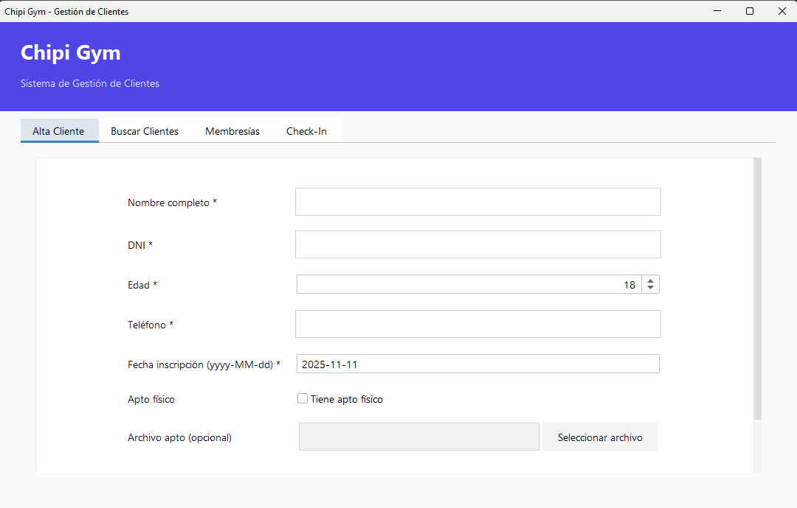
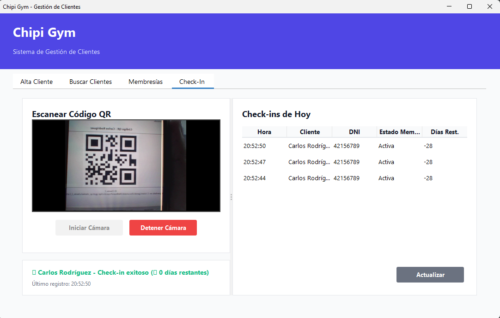
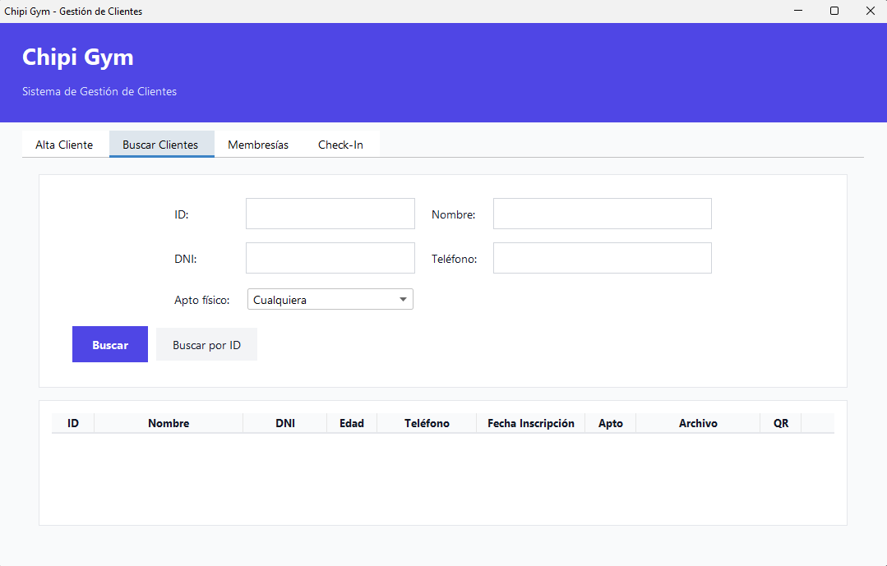

# 🏋️‍♂️ Chipi Gym - Management System

[](https://www.oracle.com/java/)
[](https://www.mysql.com/)
[](https://maven.apache.org/)
[](LICENSE)

> **[Español](#español) | [English](#english)**

---

<a name="english"></a>

## 🌟 English

### 📖 About The Project

**Chipi Gym** is a comprehensive desktop application for managing gym operations, built with Java Swing. It features a complete QR code-based check-in system, member management, and membership tracking.

#### ✨ Key Features

- **👥 Client Management**: Register, search, update, and delete gym members
- **💳 Membership Management**: Create, renew, and track membership status
- **📸 QR Check-In System**: Automated check-in using webcam and QR codes
- **🔍 Advanced Search**: Filter clients by multiple criteria
- **📊 Reports**: View check-in history and membership renewals
- **📄 Medical Clearance**: Upload and track fitness certificates
- **⚠️ Expiry Alerts**: Automatic notifications for expiring memberships

### 🛠️ Technologies Used

#### Core Technologies
- **Java 17+** - Main programming language
- **Java Swing** - GUI framework
- **MySQL 8.0+** - Database management
- **Maven** - Dependency management and build tool

#### Libraries & Dependencies
- **ZXing (Zebra Crossing)** `3.5.3` - QR code generation and scanning
  - `com.google.zxing:core`
  - `com.google.zxing:javase`
- **Webcam Capture** `0.3.12` - Camera access for QR scanning
  - `com.github.sarxos:webcam-capture`
- **MySQL Connector/J** `8.0.33` - JDBC driver for MySQL
- **JCalendar** `1.4` - Date picker component

### 📋 Prerequisites

Before running the application, ensure you have:

- **Java JDK 17 or higher** installed
- **MySQL Server 8.0+** running
- **Maven 3.6+** (or use the included Maven Wrapper)
- **Webcam** (for QR check-in feature)

### 🚀 Installation & Setup

#### 1. Clone the Repository

```bash
git clone https://github.com/GFacundoN/Chipi-Gym.git
cd Chipi-Gym
```

#### 2. Configure Database

Create the database and tables:

```sql
-- Run in MySQL Workbench or command line
CREATE DATABASE IF NOT EXISTS chipi_gym;
USE chipi_gym;

-- Execute the schema files
SOURCE database_schema.sql;
SOURCE checkins_schema.sql;
```

#### 3. Configure Database Connection

Edit `src/main/java/com/chipigym/chipi/gym/ConexionBD.java`:

```java
private static final String URL = "jdbc:mysql://localhost:3306/chipi_gym";
private static final String USER = "your_username";
private static final String PASSWORD = "your_password";
```

#### 4. Build the Project

Using Maven:
```bash
mvn clean install
```

Or using Maven Wrapper:
```bash
./mvnw clean install  # Linux/Mac
mvnw.cmd clean install  # Windows
```

#### 5. Run the Application

Using Maven:
```bash
mvn exec:java
```

Or using NetBeans:
- Open project in NetBeans
- Right-click project → Run

### 📸 QR Check-In System

#### How It Works

1. **Generate QR Code**:
   - Go to "Search Clients" tab
   - Click the "QR" button next to any client
   - QR code is generated and saved in `qr_clientes/` folder

2. **Perform Check-In**:
   - Go to "Check-In" tab
   - Click "Start Camera"
   - Show the QR code to the camera
   - System automatically registers the check-in

#### Features
- ✅ Real-time QR detection (200ms scan interval)
- ✅ Automatic membership validation
- ✅ 3-second cooldown to prevent duplicate entries
- ✅ Visual and audio feedback
- ✅ Daily check-in history

### 📁 Project Structure

```
chipi-gym/
├── src/main/java/com/chipigym/chipi/gym/
│   ├── CheckIn.java              # Check-in model
│   ├── CheckInDAO.java            # Check-in data access
│   ├── CheckInPanel.java          # Check-in UI panel
│   ├── Cliente.java               # Client model
│   ├── ClienteDAO.java            # Client data access
│   ├── ChipiGymUI.java            # Main application window
│   ├── ConexionBD.java            # Database connection
│   ├── Main.java                  # Application entry point
│   ├── Membresia.java             # Membership model
│   ├── MembresiaDAO.java          # Membership data access
│   ├── QRGenerator.java           # QR code generator
│   └── QRScanner.java             # QR code scanner
├── database_schema.sql            # Main database schema
├── checkins_schema.sql            # Check-in table schema
├── pom.xml                        # Maven configuration
└── README.md                      # This file
```

### 🎯 Usage Examples

#### Register a New Client

1. Navigate to "Client Registration" tab
2. Fill in required fields (Name, ID, Age, Phone)
3. Select registration date
4. Upload fitness certificate (optional)
5. Click "Save Client"

#### Manage Memberships

1. Go to "Memberships" tab
2. Search client by ID or DNI
3. View current membership status
4. Renew or create new membership
5. See upcoming renewals

### 🔧 Configuration

#### Cooldown Time

Modify check-in cooldown in `CheckInPanel.java`:
```java
private static final long COOLDOWN_MS = 3000; // 3 seconds (default)
```

#### Camera Settings

The system automatically detects the default webcam. To change settings, modify `QRScanner.java`.

### 🐛 Troubleshooting

**Camera not detected:**
- Close other applications using the camera
- Check camera permissions in Windows
- Restart the application

**QR not scanning:**
- Ensure good lighting
- Keep QR code 15-30cm from camera
- Hold stable for 1-2 seconds

**Database connection error:**
- Verify MySQL server is running
- Check credentials in `ConexionBD.java`
- Ensure database exists

### 🤝 Contributing

Contributions are welcome! Please feel free to submit a Pull Request.

1. Fork the Project
2. Create your Feature Branch (`git checkout -b feature/AmazingFeature`)
3. Commit your Changes (`git commit -m 'Add some AmazingFeature'`)
4. Push to the Branch (`git push origin feature/AmazingFeature`)
5. Open a Pull Request

### 📝 License

This project is licensed under the MIT License - see the [LICENSE](LICENSE) file for details.

### 👤 Author

**Facundo Gomez**
- GitHub: [@GFacundoN](https://github.com/GFacundoN)

### 🙏 Acknowledgments

- [ZXing](https://github.com/zxing/zxing) - QR code library
- [Webcam Capture](https://github.com/sarxos/webcam-capture) - Webcam library
- Java Swing community

---

<a name="español"></a>

## 🌟 Español

### 📖 Acerca del Proyecto

**Chipi Gym** es una aplicación de escritorio completa para la gestión de operaciones de gimnasios, desarrollada con Java Swing. Incluye un sistema completo de check-in basado en códigos QR, gestión de clientes y seguimiento de membresías.

#### ✨ Características Principales

- **👥 Gestión de Clientes**: Registrar, buscar, actualizar y eliminar miembros del gimnasio
- **💳 Gestión de Membresías**: Crear, renovar y rastrear el estado de membresías
- **📸 Sistema de Check-In con QR**: Check-in automatizado usando webcam y códigos QR
- **🔍 Búsqueda Avanzada**: Filtrar clientes por múltiples criterios
- **📊 Reportes**: Ver historial de check-ins y renovaciones de membresías
- **📄 Apto Físico**: Cargar y rastrear certificados médicos
- **⚠️ Alertas de Vencimiento**: Notificaciones automáticas para membresías próximas a vencer

### 🛠️ Tecnologías Utilizadas

#### Tecnologías Core
- **Java 17+** - Lenguaje de programación principal
- **Java Swing** - Framework para interfaz gráfica
- **MySQL 8.0+** - Gestión de base de datos
- **Maven** - Gestión de dependencias y build

#### Librerías y Dependencias
- **ZXing (Zebra Crossing)** `3.5.3` - Generación y escaneo de códigos QR
  - `com.google.zxing:core`
  - `com.google.zxing:javase`
- **Webcam Capture** `0.3.12` - Acceso a la cámara para escaneo QR
  - `com.github.sarxos:webcam-capture`
- **MySQL Connector/J** `8.0.33` - Driver JDBC para MySQL
- **JCalendar** `1.4` - Componente selector de fechas

### 📋 Prerequisitos

Antes de ejecutar la aplicación, asegúrate de tener:

- **Java JDK 17 o superior** instalado
- **MySQL Server 8.0+** ejecutándose
- **Maven 3.6+** (o usa el Maven Wrapper incluido)
- **Webcam** (para la función de check-in QR)

### 🚀 Instalación y Configuración

#### 1. Clonar el Repositorio

```bash
git clone https://github.com/GFacundoN/Chipi-Gym.git
cd Chipi-Gym
```

#### 2. Configurar Base de Datos

Crear la base de datos y las tablas:

```sql
-- Ejecutar en MySQL Workbench o línea de comandos
CREATE DATABASE IF NOT EXISTS chipi_gym;
USE chipi_gym;

-- Ejecutar los archivos de esquema
SOURCE database_schema.sql;
SOURCE checkins_schema.sql;
```

#### 3. Configurar Conexión a Base de Datos

Editar `src/main/java/com/chipigym/chipi/gym/ConexionBD.java`:

```java
private static final String URL = "jdbc:mysql://localhost:3306/chipi_gym";
private static final String USER = "tu_usuario";
private static final String PASSWORD = "tu_contraseña";
```

#### 4. Compilar el Proyecto

Usando Maven:
```bash
mvn clean install
```

O usando Maven Wrapper:
```bash
./mvnw clean install  # Linux/Mac
mvnw.cmd clean install  # Windows
```

#### 5. Ejecutar la Aplicación

Usando Maven:
```bash
mvn exec:java
```

O usando NetBeans:
- Abrir proyecto en NetBeans
- Clic derecho en proyecto → Run

### 📸 Sistema de Check-In QR

#### Cómo Funciona

1. **Generar Código QR**:
   - Ir a la pestaña "Buscar Clientes"
   - Hacer clic en el botón "QR" junto a cualquier cliente
   - El código QR se genera y guarda en la carpeta `qr_clientes/`

2. **Realizar Check-In**:
   - Ir a la pestaña "Check-In"
   - Hacer clic en "Iniciar Cámara"
   - Mostrar el código QR a la cámara
   - El sistema registra automáticamente el check-in

#### Características
- ✅ Detección QR en tiempo real (intervalo de escaneo de 200ms)
- ✅ Validación automática de membresía
- ✅ Cooldown de 3 segundos para prevenir entradas duplicadas
- ✅ Retroalimentación visual y auditiva
- ✅ Historial de check-ins diarios

### 📁 Estructura del Proyecto

```
chipi-gym/
├── src/main/java/com/chipigym/chipi/gym/
│   ├── CheckIn.java              # Modelo de check-in
│   ├── CheckInDAO.java            # Acceso a datos de check-in
│   ├── CheckInPanel.java          # Panel UI de check-in
│   ├── Cliente.java               # Modelo de cliente
│   ├── ClienteDAO.java            # Acceso a datos de cliente
│   ├── ChipiGymUI.java            # Ventana principal
│   ├── ConexionBD.java            # Conexión a base de datos
│   ├── Main.java                  # Punto de entrada
│   ├── Membresia.java             # Modelo de membresía
│   ├── MembresiaDAO.java          # Acceso a datos de membresía
│   ├── QRGenerator.java           # Generador de códigos QR
│   └── QRScanner.java             # Escáner de códigos QR
├── database_schema.sql            # Esquema principal de BD
├── checkins_schema.sql            # Esquema tabla check-ins
├── pom.xml                        # Configuración Maven
└── README.md                      # Este archivo
```

### 🎯 Ejemplos de Uso

#### Registrar un Nuevo Cliente

1. Navegar a la pestaña "Alta Cliente"
2. Llenar los campos requeridos (Nombre, DNI, Edad, Teléfono)
3. Seleccionar fecha de inscripción
4. Cargar certificado médico (opcional)
5. Hacer clic en "Guardar Cliente"

#### Gestionar Membresías

1. Ir a la pestaña "Membresías"
2. Buscar cliente por ID o DNI
3. Ver estado actual de membresía
4. Renovar o crear nueva membresía
5. Ver próximas renovaciones

### 🔧 Configuración

#### Tiempo de Cooldown

Modificar el cooldown de check-in en `CheckInPanel.java`:
```java
private static final long COOLDOWN_MS = 3000; // 3 segundos (por defecto)
```

#### Configuración de Cámara

El sistema detecta automáticamente la webcam predeterminada. Para cambiar configuraciones, modificar `QRScanner.java`.

### 🐛 Solución de Problemas

**Cámara no detectada:**
- Cerrar otras aplicaciones que usen la cámara
- Verificar permisos de cámara en Windows
- Reiniciar la aplicación

**QR no se escanea:**
- Asegurar buena iluminación
- Mantener código QR a 15-30cm de la cámara
- Mantener estable por 1-2 segundos

**Error de conexión a base de datos:**
- Verificar que MySQL esté ejecutándose
- Revisar credenciales en `ConexionBD.java`
- Asegurar que la base de datos existe

### 🤝 Contribuciones

¡Las contribuciones son bienvenidas! Por favor, siéntete libre de enviar un Pull Request.

1. Fork del Proyecto
2. Crear tu Feature Branch (`git checkout -b feature/CaracteristicaIncreible`)
3. Commit de tus Cambios (`git commit -m 'Add: Característica increíble'`)
4. Push a la Branch (`git push origin feature/CaracteristicaIncreible`)
5. Abrir un Pull Request

### 📝 Licencia

Este proyecto está bajo la Licencia MIT - ver el archivo [LICENSE](LICENSE) para más detalles.

### 👤 Autor

**Facundo Nicolas Gandolfo**
- GitHub: [@GFacundoN](https://github.com/GFacundoN)

### 🙏 Agradecimientos

- [ZXing](https://github.com/zxing/zxing) - Librería de códigos QR
- [Webcam Capture](https://github.com/sarxos/webcam-capture) - Librería de webcam
- Comunidad de Java Swing

---

## 📸 Screenshots

### Main Dashboard


### QR Check-In System


### Client Management


---

## 🔄 Version History

- **v1.1.0** (Current) - QR Check-in system with optimizations
  - Added QR code generation and scanning
  - Webcam integration
  - Real-time membership validation
  - Anti-duplicate system with cooldown
  
- **v1.0.0** - Initial Release
  - Client management
  - Membership tracking
  - Basic reporting

---

## 📞 Support

If you encounter any issues or have questions:

- Open an [Issue](https://github.com/GFacundoN/Chipi-Gym/issues)
- Contact: [gandolfofacundonicolas@gmail.com]

---

<div align="center">

**Made with ❤️ for gym management**

⭐ Star this repo if you find it helpful!

</div>
